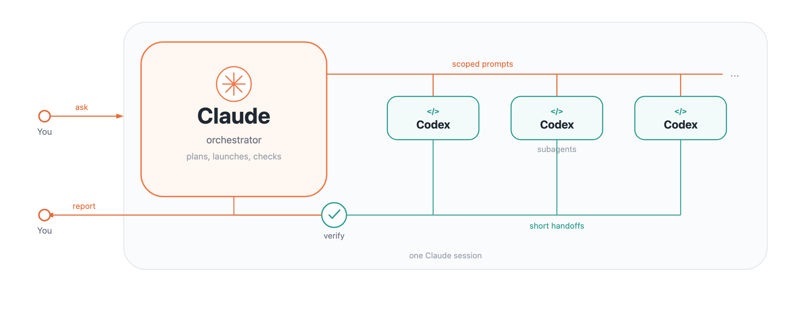
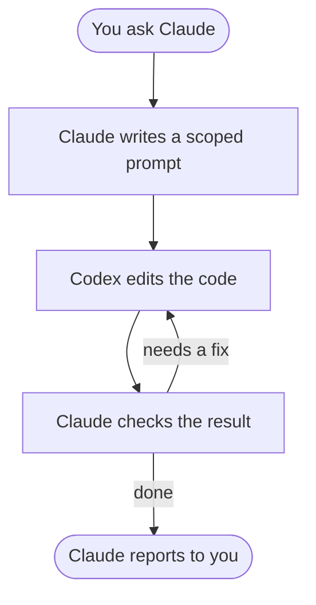

# Claude–Codex Handoff



A [Claude Code](https://code.claude.com/docs/en/overview) skill for handing scoped work to
[Codex CLI](https://developers.openai.com/codex/cli/). Claude sets the task and checks the
result. Codex edits the code in a separate session and returns a short handoff.

File reads, intermediate edits, and long logs stay in the executor session. That keeps Claude's
context small on multi-step work.

Companion skill for Cursor Grok: [claude-grok-handoff](https://github.com/MariaPaypoint/claude-grok-handoff).

## Workflow



Independent review uses a fresh Codex session in `read-only`. A live UI check stays with Claude
if only Claude has a browser.

## Install

You need installed and signed-in [Claude Code](https://code.claude.com/docs/en/overview) and
[Codex CLI](https://developers.openai.com/codex/cli/), plus Git. The `codex` command must be
available in the terminal Claude uses.

```bash
git clone https://github.com/MariaPaypoint/claude-codex-handoff.git \
  "$HOME/.claude/skills/claude-codex-handoff"
```

Open a new Claude Code session in your project. Invoke the skill explicitly:

```text
/claude-codex-handoff Have Codex add empty-result handling in the search
module and a matching test. Verify the changes before you finish.
```

Or ask in plain language:

```text
Use claude-codex-handoff. Hand this module refactor to Codex,
and verify the result yourself. Keep the public API unchanged.
```

To update:

```bash
git -C "$HOME/.claude/skills/claude-codex-handoff" pull --ff-only
```

The skill installs into Claude Code: it is instructions for the orchestrator. Codex gets a
concrete task through the CLI. You do not need to install this skill in Codex. Auth for the two
tools is independent.

## What's inside

- [SKILL.md](SKILL.md) — what to delegate, `codex exec` launch, resume by session id,
  permissions, parallel work, independent review, and acceptance.
- [`scripts/codex-ctx.sh`](scripts/codex-ctx.sh) — current Codex session context size and
  share of the window.
- [Prompt template](references/prompt-template.md) — context, bounds, checks, and handoff
  format.

Install adds text instructions only. It does not change global settings, attach services, or
start Codex.

## How the handoff works

1. Claude checks the project state and writes a bounded prompt to a file.
2. It runs Codex in the target repository with explicit permissions.
3. Codex makes the changes, runs checks, and writes the final handoff.
4. Claude compares the report with the diff and confirms acceptance criteria.
5. Follow-ups go to the same session by exact id. Independent review uses a new session.

Visual acceptance needs a working browser on the checking agent. This skill does not add a
browser or MCP tools. If the main work is a manual visual check of a small edit, delegation may
not pay off.

The model, provider, and limits come from your Claude Code and Codex settings. The skill does
not lock a model and does not promise token or dollar savings.

## Compatibility

The examples assume Bash/Zsh on macOS/Linux. On Windows use WSL or adapt the commands to your
shell. Codex needs access to the target repository and the project's usual tools.

As of 16 September 2026 the example flags match `codex-cli 0.154.0` via `codex exec --help`
and `codex exec resume --help`. Stdin, handoff, sessions, and permissions follow the official
docs:

- [Non-interactive mode](https://developers.openai.com/codex/noninteractive/)
- [Agent approvals & security](https://developers.openai.com/codex/agent-approvals-security/)
- [Claude Code skills](https://code.claude.com/docs/en/skills)

That checks the command interface and the docs, not every OS, provider, or connection. Before
the first run, check `codex --version` and your local login.

## License

[MIT](LICENSE) — use, modify, and distribute, including commercially, with the copyright notice
and license text preserved.
